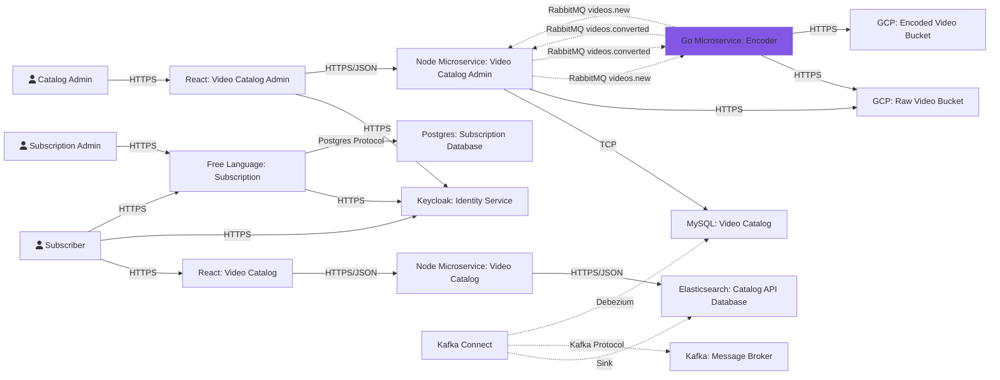

# Microservice: Encoder
Microservice developed to support video encoding of the hypotetical project called Codeflix.
## Technologies
This project was developed using the following technologies:
- [Go](https://go.dev/)
- [RabbitMQ](https://www.rabbitmq.com/)
## Pre-requisites
To run this project locally, you must install the following tools in your development environment:
- [Docker](https://www.docker.com/)
- [Docker Compose](https://docs.docker.com/compose/)
## How to Run
To run this project, follow these steps:
1. Clone this repository
```bash
# Clone via ssh
❯ git clone git@github.com:ayrtonbsouza/codeflix-encoder-microservice.git

# Or clone via HTTPS
❯ git clone https://github.com/ayrtonbsouza/codeflix-encoder-microservice.git
```
2. Go to project folder
```bash
❯ cd codeflix-encoder-microservice
```
3. Rename the `.env.example` file to `.env`
```bash
❯ mv .env.example .env
```
4. Run docker compose file
```bash
❯ docker compose up -d
```
5. Access the container and run the application
```bash
❯ docker exec -it codeflix-encoder-microservice_app_1 make server
```

## Running Tests
To run tests, follow these steps:
1. Go to project folder
```bash
❯ cd cd codeflix-encoder-microservice
```
2. Rename the `.env.example` file to `.env`
```bash
❯ mv .env.example .env
```
3. Run docker compose file
```bash
❯ docker compose up -d
```
4. Wait until the container start and access it
```bash
❯ docker exec -it codeflix-encoder-microservice_app_1 bash
```
5. Run tests
```bash
❯ go test ./...
```

## Message Patterns
### Sending Message

In order for a message to be parsed by the encoder system, it must be sent in the following json format:
```json
{
  "resource_id": "my-resource-id-can-be-a-uuid-type",
  "file_path": "video.mp4"
}
```
| Field name  | Description                                           | Type   |
|-------------|-------------------------------------------------------|--------|
| resource_id | Represents the ID of the video you want to convert.   | string |
| file_path   | It's the full path of the mp4 video inside the bucket | string |

### Response Message
#### Success

For each video processed, the encoder will send the processing result to an exchange (to be configured in `.env` file). If the processing was completed successfully, the response pattern will be:

```json
  {
    "id":"bbbdd123-ad05-4dc8-a74c-d63a0a2423d5",
    "output_bucket_path":"codeeducationtest",
    "status":"COMPLETED",
    "video":{
        "encoded_video_folder":"b3f2d41e-2c0a-4830-bd65-68227e97764f",
        "resource_id":"aadc5ff9-0b0d-13ab-4a40-a11b2eaa148c",
        "file_path":"invitation.mp4"
    },
    "Error":"",
    "created_at":"2020-05-27T19:43:34.850479-04:00",
    "updated_at":"2020-05-27T19:43:38.081754-04:00"
  }
```
Since `encoded_video_folder` is the folder that has the converted video.

#### Error
In case of an error, the response pattern in json will be:
```json
  {
    "message": {
        "resource_id": "aadc5ff9-010d-a3ab-4a40-a11b2eaa148c",
        "file_path": "invitation.mp4"
    },
    "error":"Reason for error"
  }
```

In addition, the encoder will send the original message that had a problem during processing to a dead letter exchange. Just configure the desired DLX in the .env file in the parameter: `RABBITMQ_DLX`.

## Concepts
This project was developed using concepts found in the following references:
- [Clean Code](https://www.amazon.com/Clean-Code-Handbook-Software-Craftsmanship/dp/0132350882)
- [Clean Architecture](https://www.amazon.com/Clean-Architecture-Craftsmans-Software-Structure/dp/0134494164/ref=sr_1_1?keywords=clean+architecture&qid=1659496918&s=books&sprefix=clean+archi%2Cstripbooks-intl-ship%2C181&sr=1-1)
- [Test Driven Development](https://www.amazon.com/Learning-Test-Driven-Development-Polyglot-Uncluttered/dp/1098106474/ref=sr_1_2?crid=KVDJAO2X3D08&keywords=test+driven+development+javascript&qid=1659496955&s=books&sprefix=test+driven+development+javascript%2Cstripbooks-intl-ship%2C163&sr=1-2)
- [Hexagonal Architecture](https://en.wikipedia.org/wiki/Hexagonal_architecture_(software))

## Architecture
This is the design of the architecture that make up the applications of the Codeflix project. The microservice developed in this repository is highlighted in purple.

## License
This project is licensed under the ISC License. See the [license file](LICENSE) for more information.

---
Made with ❤️ by **Ayrton Souza** :wave: [Get in touch!](https://web.whatsapp.com/send?phone=+5511941800859)